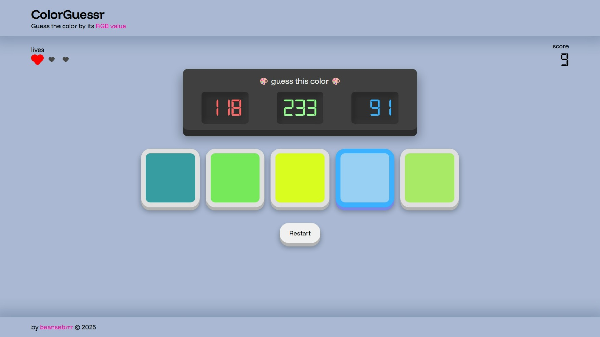

# ColorGuessr 🎨

**ColorGuessr** is a little game I developed with HTML, CSS, and JavaScript. You will be provided a set of numbers that correspond to an *RGB value*, and below it, five buttons of different colors. Once you visit the [website](https://rgb-guessr.vercel.app/), the game starts immediately. You must determine which color corresponds with the prompted value. Rack up as many points as you can, but get one wrong, and you lose a life. Lose all three of your lives, it’s game over.

## How does it work?

The JavaScript code contains a function called `GenerateRandomColor()`, which is the lifeblood of this entire app. It can return an array of 3 random numbers from 0 to 255 (the range of each value in RGB), or it can even return a string that's already formatted as `rgb(X, Y, Z)` where `XYZ` are random numbers.

### Startup

Upon starting the game (or hitting the `Restart` button), the game will run a `reset()`, which performs the following: 

1. A new **correct** color will be generated.
2. The color prompt (the "guess the color" box) will be updated to display the values of the new color
3. Your number of lives will be set to 3.
4. The scoreboard will be set to 0.
5. 5 choices will be generated; 4 will have random colors but never the correct color, and the other 1 will have the correct color.

### Choice Buttons

Choice buttons have their own general css class, which is always assigned to them. Their unique colors, however are styled inline with the element.

### Evaluating

The game listens to whenever a button is clicked. It then compares the button's color with the correct color. If the colors match, it dispatches an event `correct`. Otherwise, it dispatches the event `incorrect`.

When the `correct` event is run, it executes a function that will...

1. Add +1 to the score
2. Update the scoreboard
3. Run `setup()` to start a new round
   - `setup()` is like `reset()` but without replenishing your lives or resetting your score to 0.

... while the `incorrect` event will display a game over screen which shows you your total score. A `Restart` button is also displayed below.